# Image-processing

Written in VS 2019 as C++/CLR Console App (.NET framework) 
<b>!! Not tested anywhere else than VS 2019 !!</b> 
<b>!! Not optimised for big images !!</b>

# Algorithms:
  - [Normalization](#normalization)
  - [Standard deviation filtering](#standard-deviation-filtering)
  - [Opening](#opening) (morphology)
  - [Connected component labeling](#connected-component-labeling) ( 8 directions )

# Normalization
## Description
wiki description: https://en.wikipedia.org/wiki/Normalization_(image_processing)  
This programme uses input image's pixels as values ranged on a X axis, 
while the output is located on a Y axix. Values are being transfered with the help of 
Y = a*X + b functions. Those functions are being created just as shown below, using input points,  
provided by the programme' user.  
<b>Points (0,0) and (255,255) are hard-coded.</b>
 
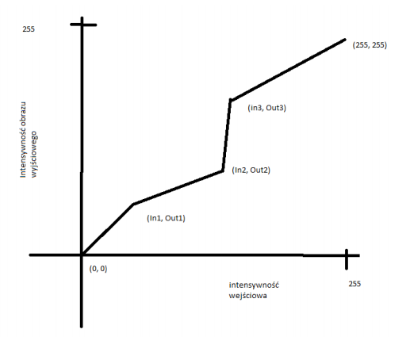

## Examples
### RGB

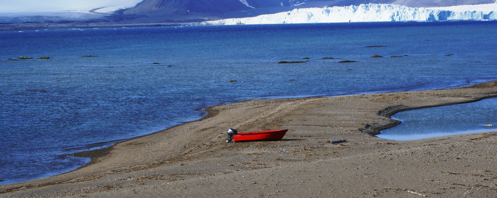
### Monochromatic
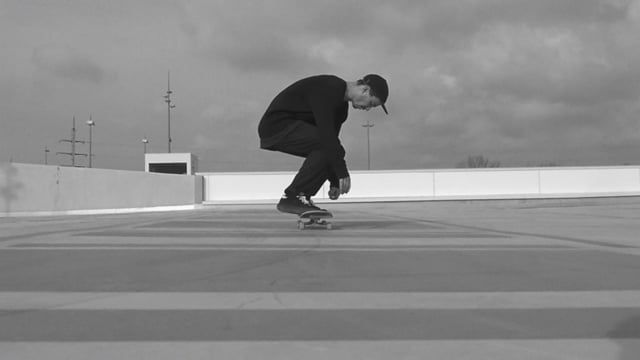
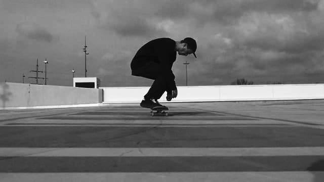

# Standard-deviation-filtering
## Description
wiki description: https://en.wikipedia.org/wiki/Gaussian_filter  
This programme is also very simple. It's purpose is to scan through the input image' pixels 
using a mask (user chooses its size). When the mask works on a specific pixel, it gathers  
the data from its neighbours, to calculate their standard-deviation, then quick normalization  
happens (to spread the data evenly across the (0,255) range) and that is all. This value is  
then saved to the output image.  

<b>Because the mask needs all of its values to work, when choosing a bigger mask, the output image  
gains a black frame around itself.</b>

## Examples
### RGB

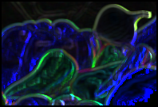
### Monochromatic
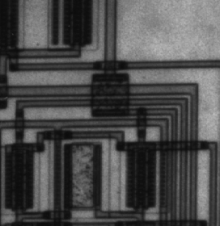
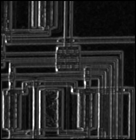

# Opening
## Description
wiki description: https://en.wikipedia.org/wiki/Opening_(morphology)  
https://en.wikipedia.org/wiki/Dilation_(morphology)  
https://en.wikipedia.org/wiki/Erosion_(morphology)  
Opening is an operation that looks like this:  
    opening = dilation ( ( erosion, SE ), SE )  
and SE - is a structural element, which picks the pixels around the  
computed one to find its new value.  
In my case SE is a disk created by the equation:  
          (x-a)^2+(y-b)^2=r2  
radius: 6 example:   
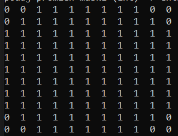  
<b>This time there is no black frame around the new image, because  
I've decided to let the mask create new pixels even when the values are not complete.  

## Examples
### Logic
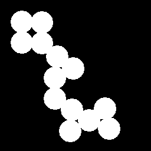

### Monochromatic

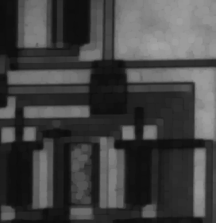

# Connected-component-labeling
## Description
wiki description: https://en.wikipedia.org/wiki/Connected-component_labeling  
The last algorithm searches for items and labels them. It then allows to for example  
count them or find if they are connected. There are two versions of the algorithm:  
  - 4 connections check: up, down, left, right,  
  - 8 connections check: above + diagonals.  
  
 My version is the 8 connections check.  
 This algorithm is recursive, and so: it is fast BUT it only works with small images.  

## Examples
### Logic
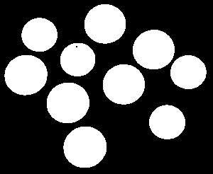
 
Result: 10 - printed out in a console And saved as .txt file.
