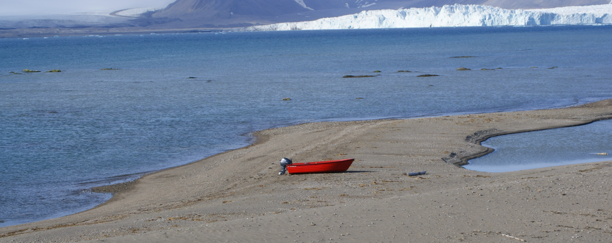

# Image-processing

Written in VS 2019 as C++/CLR Console App (.NET framework) 
<b>!! Not tested anywhere else than VS 2019 !!</b> 
<b>!! Not optimised for big images !!</b>

# Algorithms:
  - [Normalization](#normalization)
  - [Standard deviation filtering](#standard-deviation-filtering)
  - [Opening](#opening) (morphology)
  - [Connected component labeling](#connected-component-labeling) ( 8 directions )

# Normalization
## Description

## Examples
### RGB

### Monochromatic

# Standard-deviation-filtering
## Description

## Examples
### RGB

### Monochromatic

# Opening
## Description

## Examples
### Logic

### Monochromatic

# Connected-component-labeling
## Description

## Examples
### Logic

 
Result: 10 - printed out in a console And saved as .txt file
